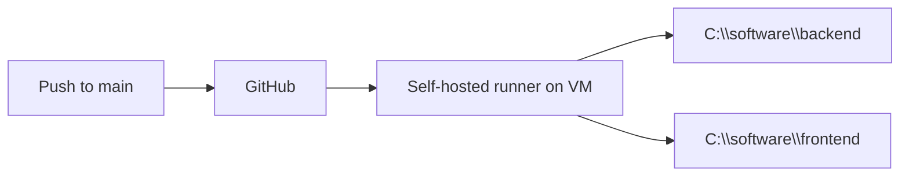

# Simple Angular + .NET Products Demo

A minimal full-stack app: Angular frontend calls an ASP.NET Core Web API that returns a static product list. No database required.

## Project structure

- `backend/` — ASP.NET Core Web API
- `frontend/` — Angular app
- `deploy.ps1` — build and deploy both apps to IIS (used by GitHub Actions)
- `publish-api.ps1` — publish backend only (manual)
- `publish-ui.ps1` — publish frontend only (manual)
- `.github/workflows/deploy.yml` — CI/CD workflow

## Prerequisites

- [.NET SDK](https://dotnet.microsoft.com/download) (10.x)
- [Node.js](https://nodejs.org/) (20 LTS)

## Run locally

Open two terminals.

### 1. Start the API

```bash
cd backend
dotnet run --launch-profile http
```

API runs at **http://localhost:5031**

### 2. Start the Angular app

```bash
cd frontend
npm start
```

App runs at **http://localhost:4200**

## Host in IIS (two separate sites)

| Site | Deploy path | URL example |
|------|-------------|-------------|
| Backend API | `C:\software\backend` | http://localhost:5031 |
| Frontend UI | `C:\software\frontend` | http://localhost:8080 |

### IIS prerequisites

1. **IIS** — Windows Features → Internet Information Services
2. **ASP.NET Core Hosting Bundle** — [.NET 10 Hosting Bundle](https://dotnet.microsoft.com/download/dotnet/10.0)
3. **IIS URL Rewrite Module** — for Angular SPA routing
4. App pools set to **No Managed Code**

After installing the Hosting Bundle:

```powershell
iisreset
```

### Manual publish

```powershell
.\publish-api.ps1   # output: publish-api\
.\publish-ui.ps1    # output: publish-ui\
```

Copy the output folders to your IIS physical paths.

---

## GitHub Actions CI/CD (on-prem IIS)

Every push to `main` triggers an automatic build and deploy to your Windows Server via a **self-hosted runner**.



### 1. Server setup (one-time on VM)

Install on the Windows Server VM:

- IIS + URL Rewrite Module
- .NET 10 SDK + Hosting Bundle
- Node.js 20 LTS
- Create IIS sites pointing to `C:\software\backend` and `C:\software\frontend`
- Grant the runner service account **Modify** on both folders

### 2. Register self-hosted runner

See **[RUNNER-SETUP.md](RUNNER-SETUP.md)** for full VM steps.

1. GitHub repo → **Settings → Actions → Runners → New self-hosted runner**
2. Choose **Windows x64**, run config on the VM
3. Install as a Windows service (`./svc.cmd install` + `./svc.cmd start`)
4. Runner must show **Idle (green)** on GitHub before deploy works

### 3. GitHub repository variables

Add under **Settings → Secrets and variables → Actions → Variables**:

| Variable | Example | Purpose |
|----------|---------|---------|
| `DEPLOY_BACKEND_PATH` | `C:\software\backend` | IIS API folder |
| `DEPLOY_FRONTEND_PATH` | `C:\software\frontend` | IIS UI folder |
| `PRODUCTION_API_URL` | `http://192.168.1.50:5031/api` | Angular prod API URL |
| `PRODUCTION_FRONTEND_ORIGIN` | `http://tms.local.com:8080` | CORS origin for API |
| `IIS_API_APP_POOL` | `ProductsApiPool` | API app pool name |
| `IIS_UI_APP_POOL` | `ProductsUiPool` | UI app pool name |

Use the VM's IP/hostname in `PRODUCTION_API_URL`, not `localhost`.

### 4. Deploy flow

On push to `main`, the workflow:

1. Checks out code on the self-hosted runner
2. Runs `deploy.ps1` which:
   - Injects `PRODUCTION_API_URL` into Angular build
   - Publishes .NET API
   - Builds Angular frontend
   - Robocopies to IIS folders
   - Writes `appsettings.Production.json` with CORS origin
   - Recycles IIS app pools

### 5. Verify

1. Push to `main`
2. Check **Actions** tab — workflow should succeed
3. Browse API: `http://<server>:5031/api/products`
4. Browse UI: `http://<server>:8080`

### Manual deploy (same as CI)

Set the environment variables, then run:

```powershell
$env:DEPLOY_BACKEND_PATH = "C:\software\backend"
$env:DEPLOY_FRONTEND_PATH = "C:\software\frontend"
$env:PRODUCTION_API_URL = "http://192.168.1.50:5031/api"
$env:PRODUCTION_FRONTEND_ORIGIN = "http://tms.local.com:8080"
$env:IIS_API_APP_POOL = "ProductsApiPool"
$env:IIS_UI_APP_POOL = "ProductsUiPool"
.\deploy.ps1
```
